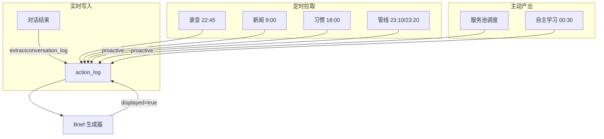

# Prism 数据架构 v2 — 主动服务系统设计

> 让 Brief 每天都有新东西，而不是炒冷饭。

## 核心问题

1. **数据写入没有统一架构** — 有的写 action_log，有的写 learning-log，Brief 只看 action_log
2. **Brief 无防重复机制** — 同一条 proactive 被反复展示
3. **没有"主动找事做"的机制** — 没新数据时 Brief 硬凑旧内容
4. **叙事不区分场景** — "首次发现福州机票"和"第三次查福州机票"用同一种语气

## 1. 数据写入架构



### 1.1 实时写入（对话触发）

**时机**：每轮对话结束后，提取摘要写入 action_log。

**不是记录每句话**，而是提取：
- 做了什么决定
- 讨论了什么主题
- 新增了什么待办
- 用户的情绪/态度

```json
{
  "timestamp": "2026-03-17T10:30:00+08:00",
  "category": "conversation",
  "title": "讨论 Brief 系统重构方案",
  "detail": "饭团要求：数据架构系统化设计、防重复、叙事区分首次/跟踪、夜间执行不被静默阻断",
  "source": "auto",
  "topic_id": "brief-system-v2",
  "narrative_type": "first_discovery"
}
```

**实现方式**：在 heartbeat 或 session 结束钩子中，用 LLM 对最近对话做一次提取。

### 1.2 定时拉取（cron 触发）

每个 cron 脚本执行完自动写 action_log（已实现）。

| Cron | 时间 | category | 写入内容 |
|------|------|----------|----------|
| audio_fetch | 22:45 | pipeline | 拉取了几天数据 |
| daily_pipeline | 23:10 | pipeline | 感知/理解/摘要执行结果 |
| services_pipeline | 23:20 | pipeline | 服务管线执行结果 |
| AI新闻日报 | 09:00 | pipeline | 今日新闻摘要 |
| habit聚合 | 00:05 | pipeline | 行为数据聚合结果 |

### 1.3 主动产出（服务池驱动）

**自主学习 cron**（00:30）和**服务池调度**产出的内容，必须写 action_log：

```json
{
  "timestamp": "2026-03-17T03:15:00+08:00",
  "category": "proactive",
  "title": "福州机票价格跟踪：4/4厦航降至¥450",
  "detail": "比上次查询（3/14 ¥500）降了¥50。目前最低价...",
  "source": "service_pool",
  "topic_id": "fuzhou-flight",
  "narrative_type": "tracking",
  "previous_value": "¥500",
  "current_value": "¥450"
}
```

## 2. action_log 增强

### 新增字段

| 字段 | 类型 | 说明 |
|------|------|------|
| `displayed` | bool | Brief 展示过则标记为 true，下次不再展示 |
| `narrative_type` | enum | `first_discovery` / `tracking` / `update` / `reminder` |
| `topic_id` | string | 同主题的多次记录聚合标识（如 `fuzhou-flight`） |
| `cooldown_until` | ISO datetime | 冷却期截止，此前不再对此 topic 产出新内容 |

### 完整 Schema

```json
{
  "timestamp": "ISO 8601",
  "category": "conversation | pipeline | proactive | maintenance | delivery",
  "title": "一句话标题",
  "detail": "详细内容",
  "source": "auto | manual | service_pool | cron | learning",
  "topic_id": "可选，同主题聚合标识",
  "narrative_type": "first_discovery | tracking | update | reminder",
  "displayed": false,
  "cooldown_until": "可选，ISO 8601"
}
```

### 向后兼容

旧格式（无新字段）自动视为 `displayed: false, narrative_type: first_discovery`。

## 3. 服务池机制

### 3.1 设计目标

> 没事做就找事做，有事做就做最有价值的。

服务池是一个"可执行任务"的优先队列。每晚自主学习从中选择要做的事。

### 3.2 数据结构

文件：`memory/service_pool.json`

```json
{
  "version": 1,
  "services": [
    {
      "service_id": "fuzhou-flight",
      "title": "福州机票价格追踪",
      "category": "price_tracking",
      "description": "监控北京→福州直飞机票价格变化",
      "trigger": "price_change > 30 OR days_since_last > 3",
      "cooldown_days": 3,
      "priority": 8,
      "status": "active",
      "created_at": "2026-03-14T00:00:00+08:00",
      "last_executed": "2026-03-16T14:55:00+08:00",
      "last_result_summary": "最低¥500（厦航4/4）",
      "execution_count": 2,
      "expires_at": "2026-04-10T00:00:00+08:00"
    }
  ]
}
```

### 3.3 服务分类

| 类别 | 冷却期 | 示例 | 过期条件 |
|------|--------|------|----------|
| price_tracking | 3天 | 机票、商品 | 用户出行后/购买后 |
| info_tracking | 1天 | AI新闻、竞品动态 | 无（持续） |
| life_service | 7天 | 周末活动、挂号提醒 | 事件结束 |
| learning | 1天 | 新工具测评、技术验证 | 无（持续） |
| reminder | 按设定 | 皮肤科7:00放号 | 用户确认已处理 |

### 3.4 调度逻辑

```python
def pick_next_service(pool: list) -> Optional[dict]:
    """从服务池中选择下一个要执行的服务"""
    now = datetime.now()
    candidates = [
        s for s in pool
        if s["status"] == "active"
        and not is_expired(s, now)
        and not is_in_cooldown(s, now)
    ]
    if not candidates:
        return None
    # 按优先级降序，同优先级按最久未执行排序
    candidates.sort(key=lambda s: (-s["priority"], s["last_executed"]))
    return candidates[0]
```

### 3.5 服务池来源

服务池条目从以下渠道自动/手动添加：

1. **对话提取**（自动）：聊天中提到"想去福州" → 自动创建 price_tracking 服务
2. **手动添加**：用户说"帮我盯着XX" → 创建对应服务
3. **系统内置**：AI新闻、系统健康检查等常驻服务
4. **学习发现**：自主学习发现有价值的新方向 → 创建 learning 服务

## 4. Brief 防重复机制

### 4.1 展示标记

Brief 生成后，将已展示的 action_log 条目标记为 `displayed: true`：

```python
def mark_displayed(log_entries: list, displayed_ids: set):
    """标记已展示的条目"""
    for entry in log_entries:
        if id(entry) in displayed_ids:
            entry["displayed"] = True
    # 回写文件
```

### 4.2 去重读取

Brief 生成器只读取 `displayed != true` 的条目：

```python
def load_fresh_actions(date: str) -> list:
    """只加载未展示过的 action_log 条目"""
    actions = load_actions_for_date(date)
    return [a for a in actions if not a.get("displayed", False)]
```

### 4.3 空内容策略

没有新 proactive 内容时，不硬凑：

- ✅ "昨晚系统正常运行，所有定时任务执行成功。"
- ✅ 从 learning-findings 中随机挑一条"💡 你可能感兴趣"的轻量知识
- ❌ 不再重复展示上次的福州机票/皮肤科信息

## 5. 叙事引擎

### 5.1 叙事类型定义

| narrative_type | 语气 | 模板 |
|----------------|------|------|
| first_discovery | 新鲜、主动 | "注意到你提到了X，帮你查了一下：..." |
| tracking | 对比、增量 | "X有新变化：从Y变成了Z，建议..." |
| update | 简洁、提醒 | "X的最新情况：..." |
| reminder | 及时、行动导向 | "提醒：X的时间快到了，建议..." |

### 5.2 Prompt 模板

```
你在生成 Brief 时，根据每条 action_log 的 narrative_type 选择叙事方式：

**first_discovery**: 
"我注意到{scene}，帮你{action}。{detail}。"
重点：为什么关注 + 做了什么 + 结果

**tracking**:
"关于{topic}的最新变化：{change_summary}。{comparison_with_last}。建议{suggestion}。"
重点：跟上次比有什么不同 + 建议

**update**:
"{topic}最新情况：{detail}。"
重点：简洁，只说增量信息

**reminder**:
"提醒：{topic}{time_info}。{action_suggestion}。"
重点：时间紧迫感 + 下一步行动
```

### 5.3 同 topic 聚合

同一个 topic_id 下的多条记录，Brief 只展示最新一条，但带上历史脉络：

```
"关于福州机票（第3次跟踪）：4/4 厦航降到¥450，比你第一次问时（¥500）低了¥50。
3月28日海航¥590 未变。如果清明去，现在下手不错。"
```

## 6. 夜间执行保障

### 6.1 原则

| | 夜间（23:00-08:00） | 白天 |
|---|---|---|
| 执行任务 | ✅ 正常执行 | ✅ 正常执行 |
| 写 action_log | ✅ 正常写入 | ✅ 正常写入 |
| 发消息给用户 | ❌ 静默 | ✅ 正常发送 |
| Brief 推送 | ❌ 等到 8:30 | ✅ 正常推送 |

### 6.2 需要修改的代码

**pipeline.py**：quiet_hours 只拦 morning_push 推送，不拦 pipeline 执行。当前实现已正确（只在 morning pipeline 中检查）。

**action.py**：`is_quiet_hours()` 只拦 L2/L3 级别的**主动推送**，不拦执行。需要确认：
- 执行动作（查机票、写日志）→ 不被 quiet_hours 拦
- 发送通知（飞书消息）→ 被 quiet_hours 拦

**自主学习 cron**：delivery=none，完全不受影响。✅

### 6.3 验证清单

- [ ] 00:30 自主学习 cron 正常触发并执行
- [ ] 执行结果写入 action_log
- [ ] 不发送任何消息给用户
- [ ] 08:30 Brief 读取到夜间产出的 action_log 并展示

## 7. 实施路线图

### Phase 1 — 立即（今天）

| 任务 | 优先级 | 预计 |
|------|--------|------|
| action_log 增加 displayed/narrative_type/topic_id 字段 | P0 | 30min |
| Brief 生成器只读 `displayed != true` 的条目 | P0 | 30min |
| Brief 生成后标记已展示条目 | P0 | 15min |
| 自主学习 cron prompt 加"执行完写 action_log"指令 | P0 | 15min |

### Phase 2 — 本周

| 任务 | 优先级 | 预计 |
|------|--------|------|
| service_pool.json 数据结构 + 调度逻辑 | P1 | 2h |
| 叙事引擎（narrative_type → 不同 prompt） | P1 | 1h |
| 对话摘要自动写入（heartbeat 钩子） | P1 | 1h |
| 冷却期机制 | P1 | 30min |
| 空内容策略（"今天没有特别的"+ 随机知识） | P2 | 30min |

### Phase 3 — 下周

| 任务 | 优先级 | 预计 |
|------|--------|------|
| 反馈闭环（Brief 卡片加"有用/没用"按钮） | P2 | 2h |
| 服务池自动扩充（对话 → 新 topic） | P2 | 2h |
| 服务池过期/归档机制 | P3 | 1h |

---

_设计文档 v2 | 2026-03-17 | 星星_
